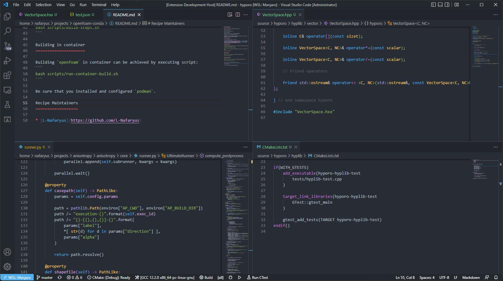

# Doom One Theme
[Description](#description) • [Supported languages](#supported-languages) • [License](#license)

# Description

Awesome theme from [Doom Emacs](https://github.com/doomemacs/doomemacs) for Visual Studio Code.

# Supported languages

* C++
* Python
* JSON
* Markdown
* and maybe others

Some languages may require extensions with semantic colorization (example: [C/C++ Themes](https://marketplace.visualstudio.com/items?itemName=ms-vscode.cpptools-themes)).

Feel free to open issues for problems or suggestions: [Issues](https://github.com/L-Nafaryus/doom-one-theme/issues)

# License

Project licensed under [GNU GPL 3](LICENSE).